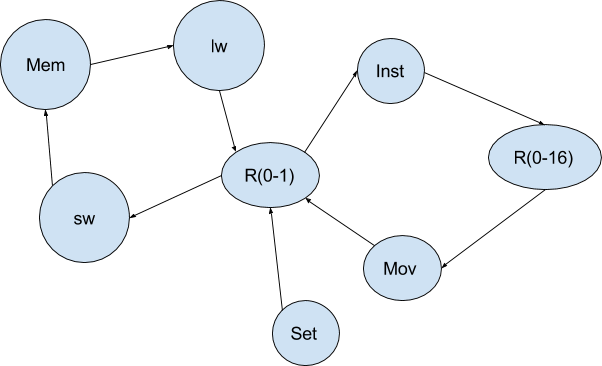

# x9
x9 is an instruction set architecture for a 9-bit processor. x9 is especially designed to run three programs in `targets/`: `cordic_x9.s`, `string_match_x9.s`, and `div_x9.s`.

## Components
+ An interpreter at `python/interpreter/`: Python module that executes x9 assembly code. The entry point to run the interpreter on all three programs is `python/interpreter_runner.py`.
+ An assembler at `python/interpreter/assembler.py`: Python module that translates x9 assembly code into machine code suitable for the processor. This module is built upon the framework of the interpreter. The entry point to run the assembler on all three programs is `python/assembler_runner.py`.
+ `Nano` at `python/interpreter/nano/`: OCaml module that translates x9 assembly code into an intermediate representation that can be easily parsed with several lines of Python code. This modules is used by the framework that underlies the interpreter.
+ `verilog/`: SystemVerilog modules defining the processor.
+ `targets/`: machine code, assembly code, and their corresponding c code.

## Green Sheet

### Architecture
Store operands in r0 and r1, execute an instruction, store
result of an instruction in any register, and move from any register to
r0 & r1. The graph below shows a general dataflow with our ISA.

### Instruction types
| Type               | Description        | Machine Code Format      | Example            |
|--------------------|--------------------|--------------------|--------------------|
| I                  | Operate on immediates        | opcode(3’b) rt(1’b) imm(5’b)       | set 4              |
| M                  | Move from any register to r0 or r1 | opcode(3’b) rs(4’b) rt(1’b) unused(1’b)            | mov r0, r4         |
| R                  | Register operations          | opcode(3’b) rd(4’b) funct(2’b)       | add r1             |
| B                  | Branches           | opcode(3’b) imm(4’b) funct(2’b)      | beq exit           |

#### Notes
M-type instruction is for retrieving value from a higher register only. Use add to move value from a lower register to a higher one.

Although both B-type and I-type instructions have immediates,
they are not of the same type. A branch instruction takes a label
reference, `lw`/`sw` instruction, a memory address, and `set` instruction, an integer literal. All of them boil down to immediate values in machine code, but at least they
represent different things in assembly, and are in fact treated
differently by the interpreter.

### Instructions

Machine code of all instructions of a type has the same format.

| Mnemonic     | Type         | RTL          | Usage        | Opcode       | Funct        |
|--------------|--------------|--------------|--------------|--------------|--------------|
| add          | R            | {cout, R[rd]} = R[0] + R[1] | add rd       | 0            | 0            |
| adc          | R            | {cout’, R[rd]} = R[0] + R[1] + cout | adc rd       | 0            | 1            |
| sub          | R            | R[rd] = R[0] - R[1] | sub rd       | 0            | 2            |
| lwr          | R            | R[rd] = Mem[R[0]] | lwr rd       | 0            | 3            |
| lw           | I            | R[rt] = Mem[lw\_LUT[imm]] | lw rt, imm   | 1            | N/A          |
| sw           | I            | Mem[sw\_LUT[imm]] = R[rt] | sw rt, imm   | 2            | N/A          |
| beq          | B            | if (R[0] == R[1]) pc = beq\_LUT[imm] | beq imm      | 3            | 0            |
| bne          | B            | if (R[0] != R[1]) pc = bne\_LUT[imm] | bne imm      | 3            | 1            |
| blts         | B            | if ((signed)R[0] \< (signed)R[1]) pc = bgt\_LUT[imm] | blts imm     | 3            | 2            |
| blt          | B            | if (R[0] \< R[1]) pc = blt\_LUT[imm] | blt imm      | 3            | 3            |
| mov          | M            | R[rt] = R[rs]      | mov rt, rs   | 4            | N/A          |
| sll          | R            | R[rd] = R[0] \<\< R[1] | sll rd       | 5            | 0            |
| sra          | R            | R[rd] = (signed)R[0] \>\> R[1] | sra rd       | 5            | 1            |
| srl          | R            | R[rd] = R[0] \>\> R[1]    | srl rd       | 5            | 2            |
| N/A          | N/A          | N/A          | N/A          | 5            | 3            |
| neg          | R            | R[rd] = \~R[0]     | neg rd       | 6            | 0            |
| and          | R            | R[rd] = R[0] & R[1] | and rd       | 6            | 1            |
| or           | R            | R[rd] = R[0] \| r[1] | Or rd        | 6            | 2            |
| halt         | R            | \*magic\*    | halt         | 6            | 3            |
| set          | I            | R[rt] = imm  | set rgret imm    | 7            | N/A          |

### Pseudo instructions
| Mnemonic     | Type         | RTL          | Usage        | Opcode       | Funct        |
|--------------|--------------|--------------|--------------|--------------|--------------|
| sllc         | N/A          | N/A          | sllc reg\_m, reg\_l, shamt, reg\_mr, reg\_lr | N/A          | N/A          |
| srlc         | N/A          | N/A          | srlc reg\_m, reg\_l, shamt, reg\_mr, reg\_lr | N/A          | N/A          |

### Registers
There are 16 registers. All registers are unsigned.

R[0-2] / r0-r2 are temporary registers used by the assembler. They will
be overwritten during the execution of a pseudo-instruction. These three
registers should not be used except for providing parameters to an
instruction.

R[0-1] / r0-r1 are also rs and rt registers of R-type instructions.

R[3-15] / r3-r15 are general purpose registers.

### Memory
256 bytes.
